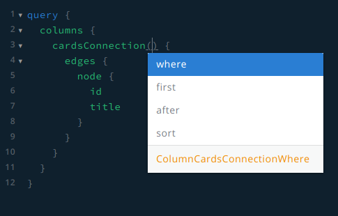
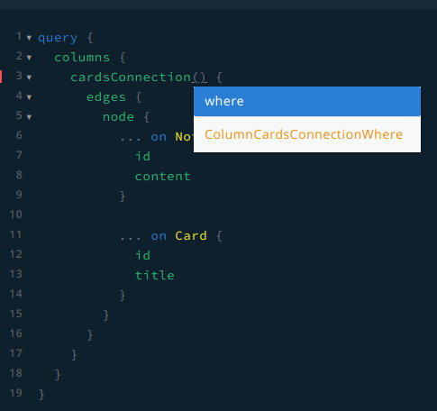

# Feature request: Union relationship sorting

## How to start the playground

In order to test the schema generation, a working neo4j instance is not
required. Simply starting the apollo server is enough:

```
# To start a server without a union type
yarn start:without-union

# To start a server with a union type
yarn start:with-union
```

## Feature description

-> Make sorting on connection work when using a union type  
Fortunately the property on `edges` is already called `node` and therefore is
agnostic to the type name.

### Sorting without a union type

Currently relationship nodes can be sorted via relationship properties.  
This repo contains an schema example (`yarn start:without-union`) that will make the
following query work:

```gql
query {
  columns {
    cardsConnection(sort: { edge: { position: ASC } }) {
      edges {
        node {
          id
          title
        }
      }
    }
  }
}
```



### Sorting with a union type

Unfortunately the same does not work when using unions. A schema example is
included (`yarn start:with-union`), the following query does not work:

```gql
query {
  columns {
    contentsConnection(sort: {
      edge: {
        position: ASC
      }
    }) {
      edges {
        node {
          ... on Note {
            id
            content
          }
          
          ... on Card {
            id
            title
          }
        }
      }
    }
  }
}
```



It does work however without the `sort` option:

```gql
query {
  columns {
    contentsConnection {
      edges {
        node {
          ... on Note {
            id
            content
          }
          
          ... on Card {
            id
            title
          }
        }
      }
    }
  }
}
```
